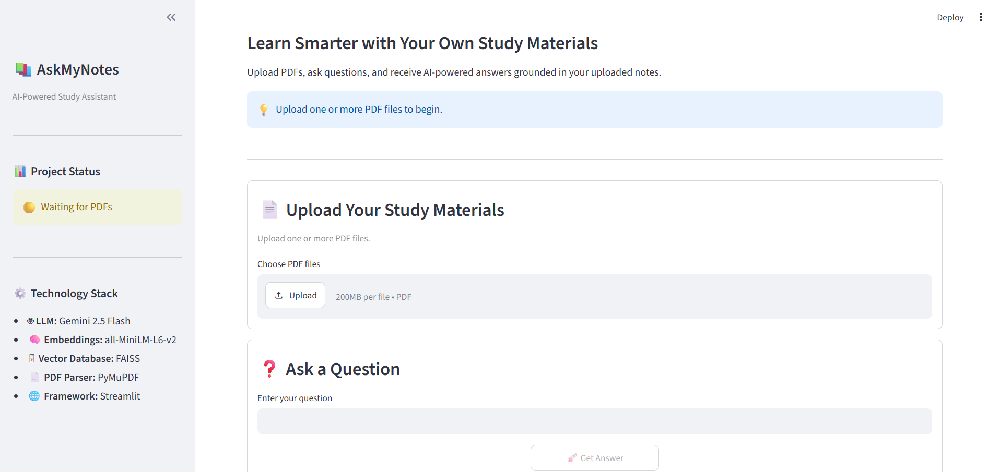
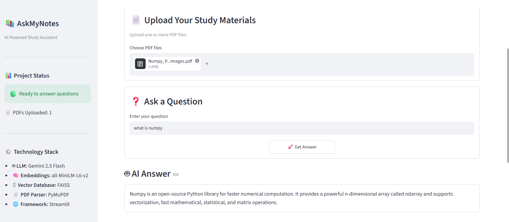
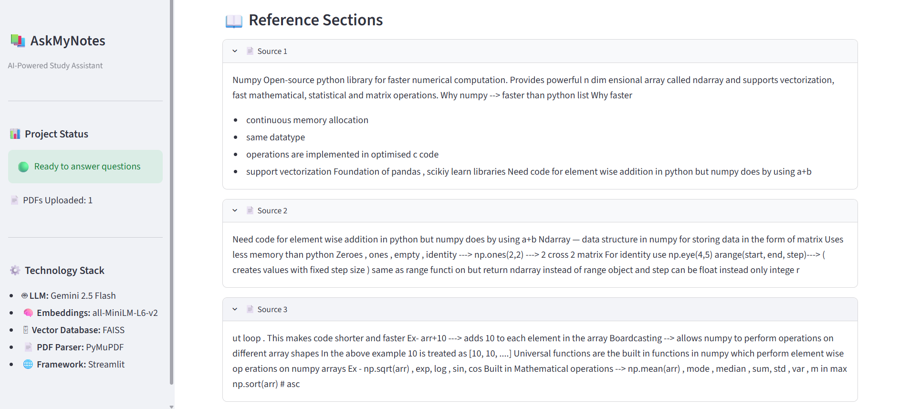

# 📚 AskMyNotes

An AI-powered Retrieval-Augmented Generation (RAG) study assistant that allows users to upload one or more PDF documents and ask questions in natural language. The application retrieves the most relevant information from the uploaded study materials using semantic search and generates accurate answers with Google's Gemini AI.

---

## 🎯 Project Objective

AskMyNotes simplifies studying by allowing users to interact with their own study materials using natural language. Instead of manually searching through lengthy PDFs, users can upload documents and receive context-aware answers powered by Retrieval-Augmented Generation (RAG).

## ✨ Features

- 📄 Upload one or multiple PDF documents
- 📖 Extract text from digital PDFs
- ✂️ Intelligent text chunking using LangChain
- 🧠 Generate semantic embeddings using Sentence Transformers
- 🔍 Fast semantic search with FAISS Vector Database
- 🤖 Context-aware answers using Gemini 2.5 Flash
- 📚 Displays reference sections used to generate each answer
- ⚡ Optimized document indexing with Streamlit Session State
- 🎨 Clean and intuitive Streamlit interface

---

## 🏗 Architecture

```
          Upload PDF(s)
                 │
                 ▼
        Text Extraction (PyMuPDF)
                 │
                 ▼
          Text Cleaning
                 │
                 ▼
     Recursive Text Chunking
      (LangChain Splitter)
                 │
                 ▼
      Sentence Embeddings
     (all-MiniLM-L6-v2)
                 │
                 ▼
        FAISS Vector Store
                 │
      User Question
                 │
                 ▼
        Query Embedding
                 │
                 ▼
      Semantic Similarity Search
                 │
                 ▼
      Relevant Context Retrieved
                 │
                 ▼
      Gemini 2.5 Flash LLM
                 │
                 ▼
          AI Generated Answer
```

---

## 🛠 Tech Stack

| Category | Technology |
|----------|------------|
| Frontend | Streamlit |
| PDF Processing | PyMuPDF |
| Text Chunking | LangChain |
| Embeddings | Sentence Transformers |
| Vector Database | FAISS |
| Large Language Model | Gemini 2.5 Flash |
| Language | Python |

---

## 📂 Project Structure

```text
AskMyNotes/
│
├── app.py
├── README.md
├── requirements.txt
├── .gitignore
├── .env
│
├── utils/
│   ├── embeddings.py
│   ├── faiss_index.py
│   ├── gemini_helper.py
│   ├── pdf_processor.py
│   └── text_chunker.py
```

---

## 🚀 Installation

### 1. Clone the Repository

```bash
git clone https://github.com/your-username/AskMyNotes.git
```

```bash
cd AskMyNotes
```

---

### 2. Create a Virtual Environment

Windows

```bash
python -m venv venv
```

Activate

```bash
venv\Scripts\activate
```

---

### 3. Install Dependencies

```bash
pip install -r requirements.txt
```

---

### 4. Configure Gemini API Key

Create a `.env` file in the project root.

```env
GOOGLE_API_KEY=YOUR_API_KEY
```

---

### 5. Run the Application

```bash
streamlit run app.py
```

---

## 💡 How It Works

1. Upload one or more PDF documents.
2. The application extracts text from the PDFs.
3. The extracted text is cleaned and divided into meaningful chunks.
4. Sentence embeddings are generated for each chunk.
5. Embeddings are indexed using FAISS for efficient semantic search.
6. When a question is asked:
   - The question is converted into an embedding.
   - The most relevant chunks are retrieved.
   - Retrieved context is sent to Gemini 2.5 Flash.
   - Gemini generates an answer strictly based on the retrieved context.

---

## 📸 Screenshots

### 🏠 Home Page



---

### 🤖 AI Answer



---

### 📖 Reference Sections



---

## 🔮 Future Improvements

- OCR support for scanned PDFs
- Persistent vector database
- Chat history
- Support for Word (.docx) and PowerPoint (.pptx)
- Highlight answer source passages
- Export answers
- User authentication

---

## 📦 Performance Optimization

To improve response time, uploaded PDFs are processed only once.

The application caches:

- Extracted text
- Text chunks
- FAISS vector index

using Streamlit Session State. Subsequent questions reuse the existing vector store instead of rebuilding it.

---

## 👩‍💻 Author

**Akhila Pappala**

Artificial Intelligence & Data Science Student

---

## ⭐ If you found this project useful

Consider giving this repository a ⭐ on GitHub.